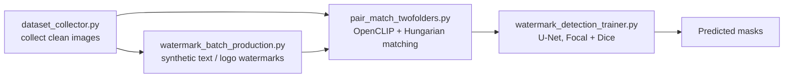

# Intelligent Watermark Pipeline

> Status: prototype (Aug–Oct 2025). Dataset generation, pair matching and mask detection are implemented and trained; the restoration stage is experimental. Personal project, sole developer.

End-to-end pipeline for building a watermark-segmentation dataset from scratch and training a detector on it: collect clean images, synthesise watermarks with randomised text / logo / opacity / rotation / blend mode, match clean–watermarked pairs, and train a U-Net-style mask predictor with a class-imbalance-aware loss.

## Results

- **1,597 clean / watermarked training pairs** generated and matched automatically; 3,141 files in the versioned dataset.
- **Mask detector**: U-Net-style segmentation network trained with Focal + Dice loss (positive-class weight 6.0, 384 px), best validation Dice **0.66** at epoch 10 on a 15% hold-out; per-epoch prediction visualisations are in `watermark_detection_training/visualizations/`.
- Pair matching uses OpenCLIP image embeddings with Hungarian assignment, so folders collected at different times can be aligned one-to-one without file-name conventions.

## Pipeline



## Tech stack

Python · PyTorch · OpenCLIP · OpenCV · NumPy · SciPy · Pillow

## Run

```bash
pip install -r requirements.txt
python dataset_collector.py                      # interactive: download / import / synthesise images
python watermark_batch_production.py --mode generate --data_dir ./data
python pair_match_twofolders.py --clean data/clean --wm data/watermarked --out data/pairs
python watermark_detection_trainer.py            # edit data_sources / config in main()
```

## Data

Training images were collected from public web sources for research use only and are not redistributed; `training_metadata.json` records the dataset signature and training parameters so a run can be reproduced from a fresh collection. Synthetic watermarks are generated by the pipeline itself.
